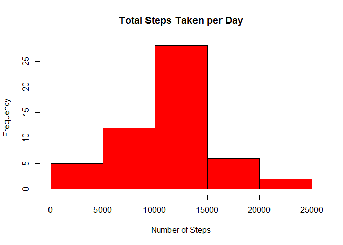
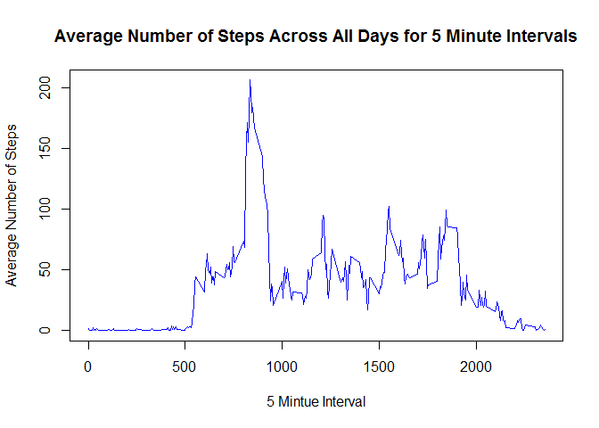
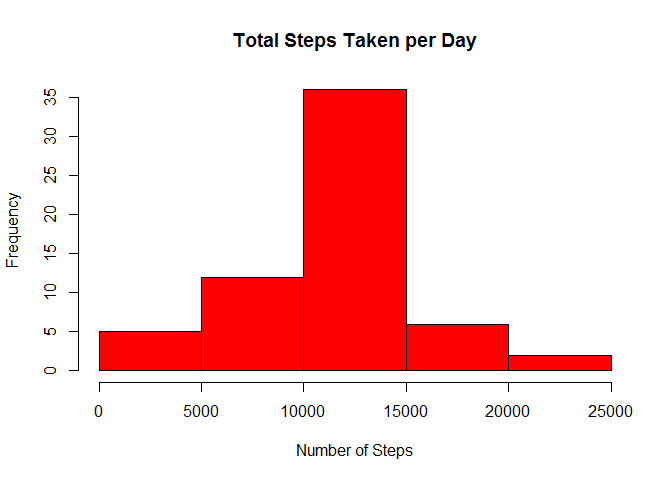
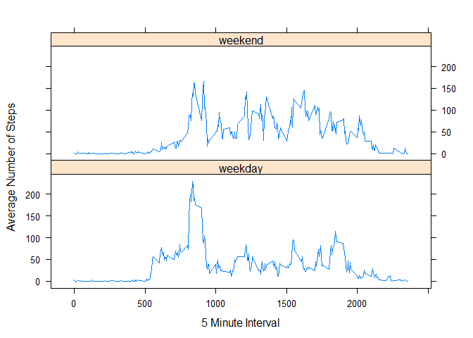

# Reproducible Research: Peer Assessment 1


## Loading and preprocessing the data

```r
activity=read.csv("activity.csv")
# change column 2 from factor to date
activity$date <- as.Date(activity$date, "%Y-%m-%d")
library(dplyr)
```

```
## 
## Attaching package: 'dplyr'
## 
## The following objects are masked from 'package:stats':
## 
##     filter, lag
## 
## The following objects are masked from 'package:base':
## 
##     intersect, setdiff, setequal, union
```
The activity data contains 17568 counts for the number of steps taken in a 5 mintue interval during 61 days in October and November 2012:

```r
head(activity)
```

```
##   steps       date interval
## 1    NA 2012-10-01        0
## 2    NA 2012-10-01        5
## 3    NA 2012-10-01       10
## 4    NA 2012-10-01       15
## 5    NA 2012-10-01       20
## 6    NA 2012-10-01       25
```

## Part 1: Ignoring Missing Values
## What is the total number of steps taken per day?

```r
# remove missing values
activity1 <- activity[!is.na(activity$steps),]
# calculate total number of steps per day
by_day <- summarize(group_by(activity1,date), sum(steps))
names(by_day) <- c("date", "steps")
# create historgram
hist(by_day$steps, col = "red", main = "Total Steps Taken per Day", xlab = "Number of Steps")
```

 

## What is mean and median total number of steps taken per day?

```r
# calculate mean number of steps per day
mean_steps <- sprintf("%g",mean(by_day$steps))
# calcuate the median number of steps per day
median_steps <- sprintf("%g",median(by_day$steps))
```
The mean number of steps is 10766.2

The median number of steps is 10765

## What is the average daily activity pattern?

```r
# calcuate the average number of steps per 5 minute interval
by_interval <- summarize(group_by(activity1,interval), mean(steps))
names(by_interval) <- c("interval", "steps")
# create plot
plot(by_interval$interval,by_interval$steps, type="l",col = "blue", xlab = "5 Mintue Interval", ylab = "Average Number of Steps", main = "Average Number of Steps Across All Days for 5 Minute Intervals")
```

 

## Which 5-minute interval contains the maximum number of steps?

```r
# find the interval with the maximum number of steps
max_index <- which.max(by_interval$steps)
max_interval <- by_interval$interval[max_index]
```
The 5-minute interval containing the maximum average number of steps is 835

## Part 2: Imputing Missing Values
## What are the total number of missing values in the dataset?

```r
# calculate the total number of NAs
missing <- is.na(activity$steps)
num_nas <- sum(missing)
```
The total number of missing values in the dataset is 2304

##Devise a strategy for filling in all of the missing values in the dataset:
Choose one of the folowing:

- mean for that day
- median for that day
- mean for the 5-minute interval

First determine which days and 5-minute intervals have missing values

```r
# group NAs by date and count number of intervals in each group
by_missing <- summarize(group_by(activity[missing,],date),count=n())
by_missing
```

```
## Source: local data frame [8 x 2]
## 
##         date count
##       (date) (int)
## 1 2012-10-01   288
## 2 2012-10-08   288
## 3 2012-11-01   288
## 4 2012-11-04   288
## 5 2012-11-09   288
## 6 2012-11-10   288
## 7 2012-11-14   288
## 8 2012-11-30   288
```
There are 8 days that have missing values for all of the 5-minute intervals,
so a mean or median for that day cannot be computed.  
Therfore use the mean for the 5-minute interval.

## Use 5-minute interval means to fill in the missing values:

```r
activity2 <- activity
# replace missing values using the 5-minute interval means
for (i in 1:nrow(activity2)) {
    if (is.na(activity2$steps[i])) {
        activity2$steps[i] <- round(by_interval$steps[by_interval$interval==activity2$interval[i]])
    }
}
head(activity2)
```

```
##   steps       date interval
## 1     2 2012-10-01        0
## 2     0 2012-10-01        5
## 3     0 2012-10-01       10
## 4     0 2012-10-01       15
## 5     0 2012-10-01       20
## 6     2 2012-10-01       25
```

## What is the total number of steps taken per day?

```r
# calculate total number of steps per day using imputed values
by_day <- summarize(group_by(activity2,date), sum(steps))
names(by_day) <- c("date", "steps")
# create historgram
hist(by_day$steps, col = "red", main = "Total Steps Taken per Day", xlab = "Number of Steps")
```

 

## What is mean and median total number of steps taken per day?

```r
# calculate mean number of steps per day
mean_steps2 <- sprintf("%g",mean(by_day$steps))
# calcuate the median number of steps per day
median_steps2 <- sprintf("%g",median(by_day$steps))
```
The mean number of steps is 10765.6 (compared to 10766.2 from Part 1)

The median number of steps is 10762 (compared to 10765 from Part 1)

These values are only slightly different from the values in Part 1 (where missing values were ignored), and therefore imputing values using the mean for the 5-minute interval has negligible impact.

## Are there differences in activity patterns between weekdays and weekends?

```r
# create a new factor variable in the dataset indicating whether a given date is a weekday or weekend day
activity2 <- mutate(activity2,day=factor(grepl("^S",weekdays(date)),labels=c("weekday","weekend")))
# calcuate the number of steps per 5 minute interval averaged across all weekdays or weekend days
by_interval <- summarize(group_by(activity2,interval,day), mean(steps))
names(by_interval) <- c("interval", "day", "steps")
# make a panel plot containing the weekend and weekday data
library(lattice)
xyplot(steps ~ interval | day, data = by_interval, type = "l", layout = c(1, 2), xlab="5 Minute Interval", ylab="Average Number of Steps")
```

 

The above plots show some small differences in activity patterns between weekdays and weekends.
